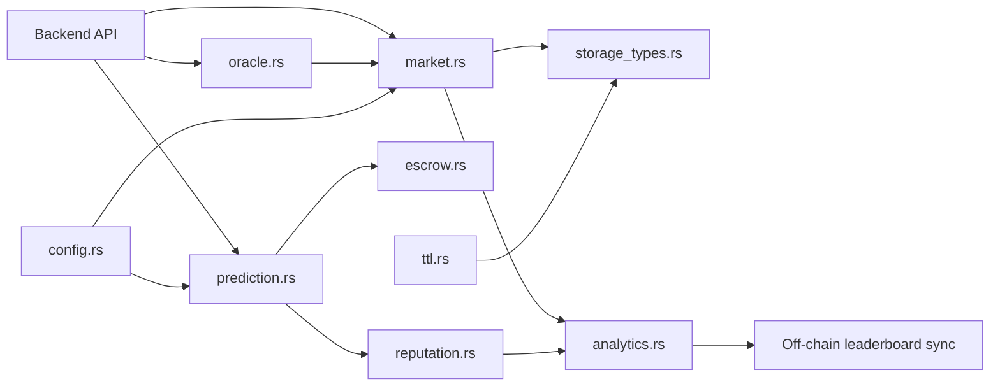

# InsightArena Contract

## 1) Overview
InsightArena's Soroban contract implements market lifecycle, prediction staking, settlement, payout distribution, reputation scoring, and season/leaderboard bookkeeping on-chain. The backend API acts as an orchestration layer around this contract: it creates markets, accepts predictions, resolves outcomes, and syncs event-driven state into PostgreSQL for query and analytics workloads.

## 2) Module Structure
| File | Purpose |
| --- | --- |
| `src/lib.rs` | Contract entry points and module wiring |
| `src/config.rs` | Global config and protocol constants |
| `src/errors.rs` | Contract error types and codes |
| `src/market.rs` | Market creation, update, and resolution logic |
| `src/prediction.rs` | Prediction submission and validation |
| `src/escrow.rs` | Stake locking and pooled fund accounting |
| `src/oracle.rs` | Outcome/oracle integration and checks |
| `src/governance.rs` | Admin and governance-related controls |
| `src/reputation.rs` | Reputation scoring updates |
| `src/season.rs` | Season boundaries and season state |
| `src/analytics.rs` | Aggregation and derived read logic |
| `src/invite.rs` | Invite/referral pathways |
| `src/security.rs` | Security helpers and guardrails |
| `src/storage_types.rs` | Storage key/value schema definitions |
| `src/ttl.rs` | TTL extension and storage retention helpers |
| `src/prediction_tests.rs` | Contract-focused test scenarios |

## 3) Quick Start
Run from `contract/` on a clean Ubuntu machine:

```bash
sudo apt-get update && sudo apt-get install -y build-essential pkg-config libssl-dev curl clang
curl https://sh.rustup.rs -sSf | sh -s -- -y
source "$HOME/.cargo/env" && rustup target add wasm32v1-none
cargo build
cargo test
```

## 4) Architecture Diagram


## 5) Key Data Flows
### Market creation
- Backend submits create-market call with title, outcomes, end/resolution times.
- `market.rs` validates config and writes market state to storage.
- Event data is emitted for backend listener synchronization.

### Prediction submission
- User submits market choice and stake amount via backend.
- `prediction.rs` validates market state and outcome.
- `escrow.rs` locks stake and updates pool totals.
- Reputation and analytics paths are updated for standings and metrics.

### Payout
- Oracle/admin resolves market outcome in `market.rs`/`oracle.rs`.
- Winners are validated against stored predictions.
- `escrow.rs` computes and releases claimable payout amounts.
- Claim events are emitted for off-chain sync and notification pipelines.

## 6) Environment Variables / Config
Primary backend-side runtime variables that must align with contract deployment:

- `STELLAR_NETWORK`: `testnet` or `mainnet`
- `SOROBAN_CONTRACT_ID`: deployed contract ID
- `SERVER_SECRET_KEY`: backend signer key used for privileged tx signing
- `SOROBAN_RPC_URL`: Soroban RPC endpoint (if omitted, backend default is used)

Contract constants and validation boundaries live in `src/config.rs`.

## 7) Testnet Deployment Guide
1. Build and test locally (`cargo build && cargo test`).
2. Install and configure Soroban CLI with a funded testnet identity.
3. Compile WASM artifact for deployment.
4. Deploy contract and capture resulting contract ID.
5. Set backend env values (`STELLAR_NETWORK`, `SOROBAN_CONTRACT_ID`, `SERVER_SECRET_KEY`, `SOROBAN_RPC_URL`) and run backend connection check.

Example Soroban CLI shape (adapt to your account/network settings):

```bash
soroban contract deploy \
  --wasm target/wasm32v1-none/release/contract.wasm \
  --source <identity> \
  --network testnet
```

## 8) Links to Related Docs
- [Repository contribution guide](../backend/.github/CONTRIBUTING.md)
- [Contract security audit notes](./SECURITY_AUDIT.md)
- [Contract storage schema notes](./STORAGE_SCHEMA.md)
